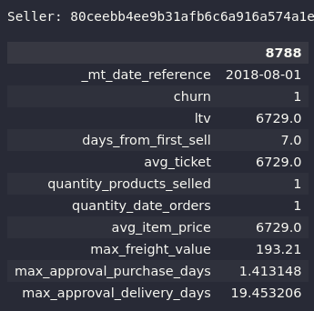

# Olist Churn

---

---

### Summary

- [1.0. Business Problem](#10-bussiness-problem)
- [2.0. Solution Strategy](#20-solution-strategy)
  - [2.1. The Mind Map](#21-the-mind-map)
  - [2.2. Problem Solving Methodology](#22-problem-solving-methodology)
  - [2.3. The Workflow](#23-the-workflow)
- [3.0. Exploratory Data Analysis](#30-exploratory-data-analysis)
  - [3.1. Silver Layer Exploration](#31-silver-layer-exploration)
    - [3.1.1. Silver Layer Key Points](#311-silver-layer-key-points)
  - [3.2. ABT Exploration](32-abt-exploration)
    - [3.2.1. Descriptive Statistics](321-descriptive-statistics)
    - [3.2.2. EDA](322-edaA)
- [4.0. Machine Learning](#40-machine-learning)
- [5.0. Business Results](#50-business-results)
- [6.0. Next Steps](#60-next-steps)

---

## 1.0. Business Problem

---

**Business Overview**: Olist is a Brazilian startup that operates in the retail technology segment. The company has solutions that facilitate the management of offline and online stores (e-commerce) and also a solution for increasing sales within marketplaces.
On the one hand, Olist concentrates sellers who want to advertise on marketplaces such as Mercado Livre, Americanas and Amazon. On the other hand, concentrate products from all sellers in a single store that is visible to the end consumer.
Olist was founded in February 2015 by Tiago Dalvi, as a spin-off from Solidarium, a company created in 2007 as a shopping store that later became a marketplace for the sale of artisanal products.

Source: Wikipedia.

**Business Problem**: In Olist, exists sellers, the sellers monthly sell some products to customers. Exists some types of sellers that can work with Olist, some of that sellers can churn (not selling more). For Olist perspective, if a seller not sell in 45 days before the last day that seller is selled any product to a customer, this seller become in churn state.

The Olist marketing team needs to a tool to identify the sellers who are likely to churn in the next month and somehow manage to retain that sellers. The strategy used by Olist's marketing team to retain these sellers is to use gift cards based on the customer's probability of churning. It is necessary to obtain this probability of the seller going into churn and select the best sellers to send the gift card. However, the Olist finance team has a restriction of $5,000 that it can make available for this gift card financial incentive for churning Olist sellers.

The marketing team of Olist have a monetary incentive to prevent seller for churning, but the finance team have a budget of $ 5.000 to spend with this monetary gift cards incentive. The objective is to maximize ROI with marketing investiment of gits cards and work with finance budget.

Do not exists historical data about marketing incentive gifts to check the efficiency of the gifts, but is possible to create some scenarios.

- If churn probability > 95% this seller will leave of Olist, maybe a very big incentive is possible to use, but I will skip this sellers.
- If churn probability is between 95% to 85% a gift card of $200 can be a solution for retain this seller.
- If churn probability is between 85% to 75% a gift card of $100 can retain.
- Others sellers with probability of churn lower than 75% a gift card of $50 can be a solution.

## 2.0. Solution Strategy

---

### 2.1. The Mind Map
For this business problem and perspective exists some factors and features that can be affect customer churn, in this context, the first thing I have done is a mind map to map and derive hypothesis for validate on EDA step and for feature engineering to create feature stores and build a ABT table to join all feature stores and create churn flag based on recency (days from last purchase).

### 2.2. Problem Solving Methodology

I have CRISP in my toolkit for rapid development of solutions and problem solving techniques, based on this, the author "Eric Ries" has a phrase in the book lean startup, "Vision leads to direction" and shows a cyclical process for startup fast projects solutions and can be applied to data science projects too!!!

### 2.3. The Workflow

For this project, the main infra of Olist is at AWS Cloud. I have developed a workflow for customer churn, from source extraction using AWS DMS to AWS Athena querying Apache Iceberg lakehouse file format. The data source is database of transactional daily data, this database is extracted with AWS DMS and stored in parquet at landing in AWS S3 Bucket, this is the first step of workflow, the extraction.

After extraction, the Apache Airflow (orchestrator of the process) execute AWS EMR to build lakehouse (multi-hop) architecture with this new fresh data extracted from source using Spark, Apache Iceberg and AWS Glue Catalog I build a lakehouse in AWS. With the file in landing, I used Apache Iceberg lake to build a lakehouse multi-hop architecture, all ingestion scripts and pipelines using AWS technology and open source tools such as Spark, Apache Iceberg and Airflow. For serving and query layer I choosed Aws Athena to query AWS Glue Data Catalog, is a expensive tool, maybe I will change in future.

With all available and clean data created with data engineering, now is the step of creating feature stores and ABT and include in main ETL of data engineering. I have created two feature stores and one ABT that is created after data engineering pipeline.

Before creating the feature stores, I explored the previously created silver layer and gold layer of lakehouse, the main objective with this data is to analyze inconsistencies and business process, I have found several "problems" and observations related to purchase orders with a status different from "delivered", based on these problems and without being in the business context to understand these special orders, I assumed my work in creating the feature stores using only purchase orders already delivered available in Silver Layer from Lakehouse. I will write more about my decisions and exploration in README.

For Data Science, Exploration, Machine Learning, Business Metrics and my decisions is created inside a AWS SageMaker notebooks, is all inside two notebooks: ([exploration notebook](notebooks_churn/grc_eda.ipynb) and [modelling & business notebook](notebooks_churn/grc_modelling.ipynb)).

All of this possible process is automatic with Terrafom and you can see a workflow in a image below.

## 3.0. Exploratory Data Analysis

---

My exploratory data analysis and exploration on the silver layer were performed in the same exploration notebook.

#### 3.1. Silver Layer Exploration

---

The idea of ​​analyzing the silver layer was to explore the database and find possible impediments, such as data inconsistency and business rules for create the feature stores.

The main tables available for this project is orders and order_items.

The order table indicate a purchase.
  - Which customer made the purchase?
  - Status of the purchase (invoiced, delivered, approved...)
  - Purchase timestamp.
  - Delivery Carrier timestamp.
  - Delivery to customer timestamp.
  - Estimated Delivery timestamp.

The order_items indicates all items in the same order (multiple products per basket).
  - In the same order, how many products has been purchased ?
  - Products has been purchased.
  - Seller that selled the product.
  - Shipping limit date.
  - Product price.
  - Freight Value.

This two tables is explored before creation of feature stores. Exists a lot of insights from silver tables that I get and explored, more detail here: [exploration notebook](notebooks_churn/grc_eda.ipynb).

##### 3.1.1. Silver Layer Key Points

---

I will resume the dataset in some key observation.

We have transactional available data between 2016-09-04 21:15:19 up to 2018-10-17 17:30:18. But is possible to see, on months 10 and 09 of 2018 respectively have only 4 and 16 orders. The last complete observation is for month 08, I can use this month to score churn to next month (09) in a production scenario to score churn for next month. The same logic apply to start of observations at 2016-09, is possible to see a good consistency only for purchases grather than 2017-02, maybe this indicate early adopters for churn marketplace bacuse have only 4 orders in all 2016-09 month. For the churn estimator, i will consider order greather than 2018-01-01 and a sliding window of 6 months for feature creation at feature store pipeline.

Looking now at order status, is possible to see some "problems".

Others 5 orders with status "created" available in this period, this five orders are quite suspicious, one is created at '2018-02-09 17:21:04' and never updated, is only with created status forever, in this same order do not have any items too. This order is created at 2018-02 and up to 2018-09 is never updated, maybe any test order created by olist team. I need to filter out this inconsistent orders. This repeat for all other orders. Do not exists any order with created status consistent, in other words, do not have any new created order in this silver table, only suspicious orders. One hypothesis is that Olist's sales funnel is very fast when a customer makes a purchase, so the order remains in the created status for a very short time.

The same pattern repeats for customers too, the same 5 customers do not have other orders than those created before, in my point of view it reinforces the idea that these are tests orders and not real orders for this customers, and this customers is only olist team members testing things in production.

And the same pattern repeats for other order status too with inconsistency between dates, infinite dates, etc.

Top three sellers at Olist in a LTV rank:

- 4869f7a5dfa277a7dca6462dcf3b52b2 with a ltf of $226,541.42.
- 53243585a1d6dc2643021fd1853d8905 with a ltf of $217,940.44.
- 4a3ca9315b744ce9f8e9374361493884 with a ltf of $171,572.17.

#### 3.2. ABT Exploration

---

Data exploration in ABT was divided into two parts, the statistical description of the data and also the exploratory analysis of the data. The statistical description was carried out to analyze the extreme values ​​of the data and the distribution of churn. The EDA was to analyze in more detail some hypotheses created during the creation of the mind map.

The Abt Features:

- *recency*: Feature created for create target, is the day from last selling.
- *avg_ticket*: Avg Ticket, is the price over products.
- *avg_order_product*: The quantity of products over unique orders.
- *max_order_items_price*: Each order can have multiple products and multiple items for same product, what are the max price of the items of products in orders.
- *min_order_items_price*: Each order can have multiple products and multiple items for same product, what are the min price of the items of products in orders.
- *avg_order_items_price*: Each order can have multiple products and multiple items for same product, what are the avg price of the items of products in orders.
- *max_item_price*: Each order can have multiple items, what are the max price of the order items.
- *min_item_price*: Each order can have multiple items, what are the min price of the order items.
- *avg_item_price*: Each order can have multiple items, what are the avg price of the order items.
- *quantity_date_orders*: Quantity of unique orders by each date the seller have at least one order. 
- *quantity_products_selled*: Total selled products by seller.
- *quantity_unique_product_selled*: Total unique prodicts selled by seller.
- *avg_seller_interval*: Average days interval between seller selling.
- *ltv*: Cumulative sum of price history of seller.
- *days_from_first_sell*: Days util seller is in the olist.
- *frequency*: Quantity unique orders over difference between first and last purchases.
- *avg_freight_value*: Avg freight value over all items. 
- *min_freight_value*: Min freight value over all items. 
- *max_freight_value*: Max freight value over all items. 
- *avg_approval_delivery_days*: Avg delay to delivery in days.
- *min_approval_delivery_days*: Min delay to delivery in days.
- *max_approval_delivery_days*: Max delay to delivery in days.
- *avg_approval_purchase_days*: Avg delay to approval in days.
- *min_approval_purchase_days*: Min delay to approval in days.
- *max_approval_purchase_days*: Max delay to approval in days.
- *quantity_delay_orders*: Quantity delay order.
- *churn*: Flag created with Recency.

##### 3.2.1. Descriptive Statistics

The main observations of descriptive statistics:

1. Missing frequency and average seller interval of some sellers, this indicates that we have fresh sellers who have not had a repeat sales experience yet.
2. The seller with Top Avg Ticket is a seller that selled only one time a expensive product.
3. Churn is very correlated with recency (targe).
4. Churn proportion is between 30% to 35%.
5. The max order items price in olist is a order with $13,440.0.

Looking at distributions of churn in each feature, is possible to see some good features that split churn and not churn, that is (min_approval_delivery_days, ltv, avg_seller_interval, quantity_date_orders, frequency).

##### 3.2.2. EDA

---

My EDA was divided into three parts, the univariate analysis of the features, just the distribution and proportion of classes, the bivariate analysis where I raised and analyzed some hypotheses and the multivariate analysis where I analyzed only linear correlations and also the biserial point test in all features related to churn. More details at [exploration notebook](notebooks_churn/grc_eda.ipynb). I will resume two hypotheses below.

**1. Sellers with a selling interval greather than one week, have 20% chance to churn.** is True. Is possible to see in plots, i used a point biserial statistics to, its return a pvalue very small.

**2. Sellers with more than one year in Olist marketplace, have a chance of 75% to churn** is False. The sellers come back and have a recorrence of sellings. Is possible to see on histograms and in a cohort of seller retention.

## 4.0. Machine Learning

---

My machine learning step is very simple I work with data preparation for modelling such as reescaling and imputation with custom sklearn imputer and mainly with Logistic Regression because is not a "black box" solution. For feature selection I used Logistic Regression coeficient pvalues, Lasso Regression and RFE reducing in a total of 15 features to work instead of 24, this selection reduced my AUC metric in one point, but make Logistic Regression more simple.
More details at: [modelling & business notebook](notebooks_churn/grc_modelling.ipynb).

The last logistic regression with feature selection and fine tuning I got this metrics in all testing dataframes:

The Cross Validation means:

And the split point in metrics:

With this Logistic Regression, I fit last with all dataset available to score the next month.

## 5.0. Business Results

---

If the Olist seller goes into churn, I'm losing a lot of money depending on the projected LTV for that seller. Assuming that there is no LTV forecast, I will make a very simple trend holt forecast taking into account a linear trend just to have a basis for calculating the estimator ROI.

Why?

The marketing team of Olist have a monetary incentive to prevent seller for churning, but the finance team have a budget of $ 5.000 to spend with this monetary gift cards incentive. The objective is to maximize ROI with marketing investiment of gits cards and work with finance budget.

To calculate the profit, i created a Holt linear forecast of LTV for all sellers. With that now I have an estimator in my hands that describes the probability of a seller churning. And the LTV of each seller.

The marketing of Olist will created a gift cards strategy to retain this sellers to not churn, but the financial team have a limit budget to invest in this project, a limit of $ 5.000, I need to maximize investiment of gift cards in certain sellers.

1. One very simple approach is to sort sellers by probability and give a monetary incentives exponentially decreassing over the probas.
2. A second approach is to use LTV as weight for better selecting clients, this fits into knapsack problem.

- Last Month Profit: $9,610,970.22.
- Estimated Profit for this month: $10,225,204.19.

I work with a Slice in sellers, Sellers with 50% Probability of Churn.

- Quantity of 268 sellers.
- Total of LTV: $487,035.81
- Total Gift to Spend to Retain all: $25,550.00

Scored Only Business Metrics:
- Total Retained LTV: $295,666.82
- Total Spended in Gifts: 5000
- Total Retained Sellers: 56 (20.90% of Sellers)

Optimal Solution Business Metrics:
- Total Retained LTV: $462,048.67
- Total Spended in Gifts: 5000
- Total Retained Sellers: 90 (33.58% of Sellers)

## 6.0. Next Steps

---

1. My deploy is a very simple Pipeline with fitted Logistic Regression, is possible to try Mlflow for deploy.
2. Explore more the validated hypothesis.
3. Explore new Features.
4. Create a churn dashboard with Metabase.
